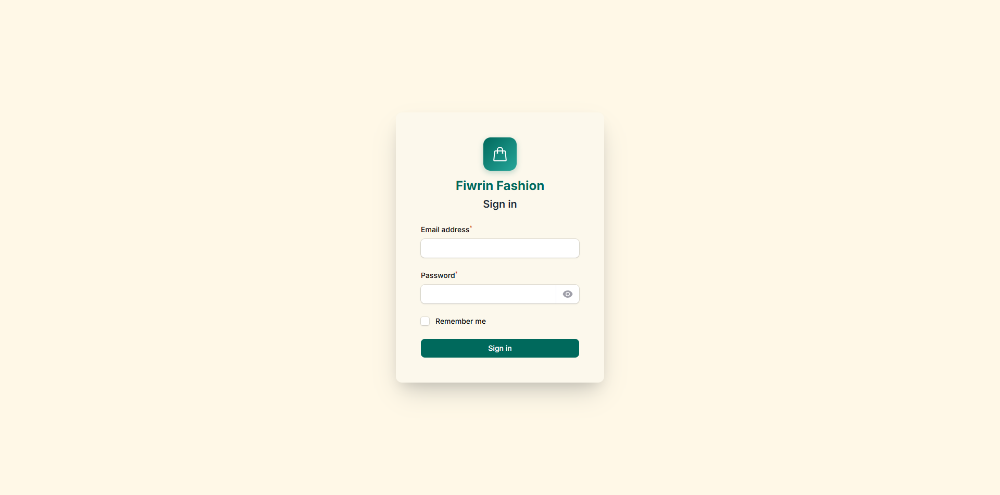
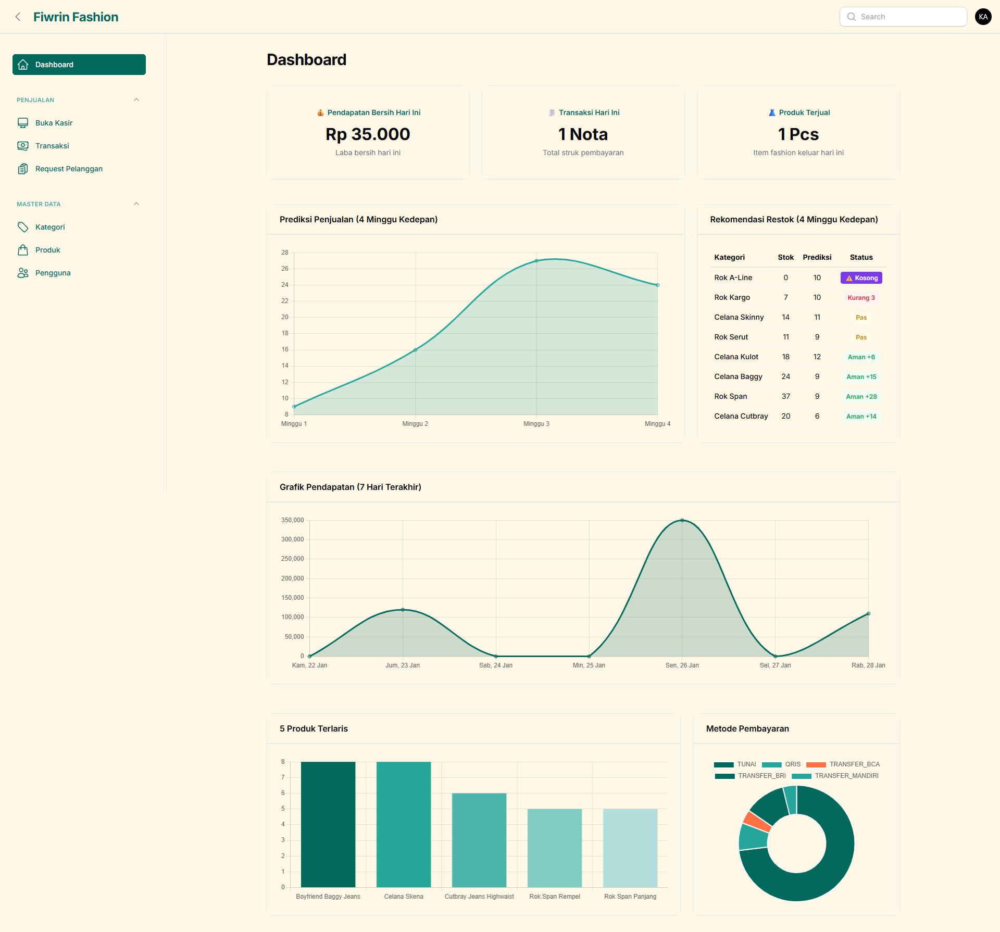
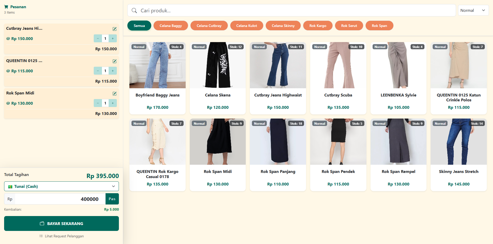
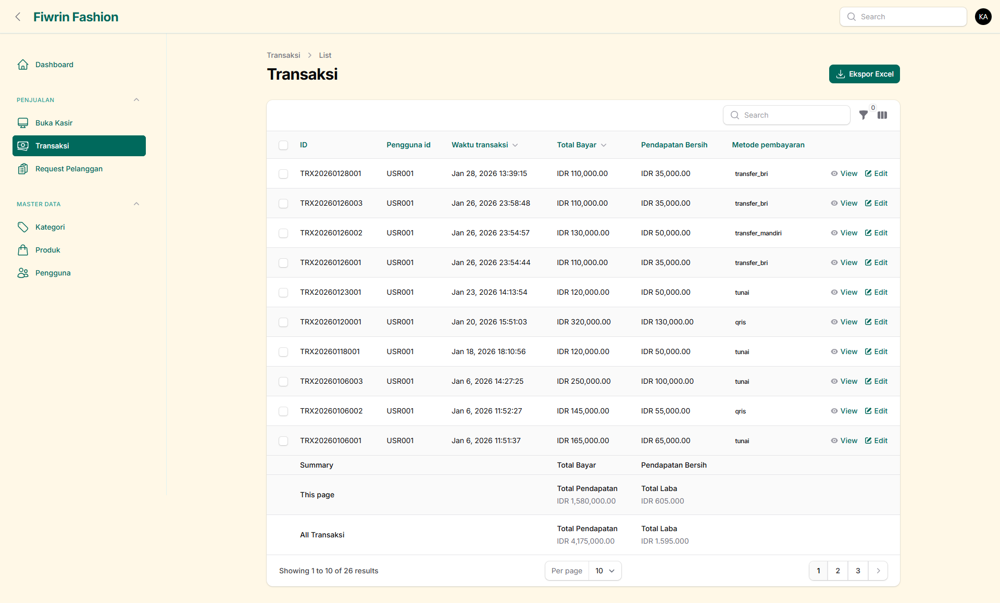
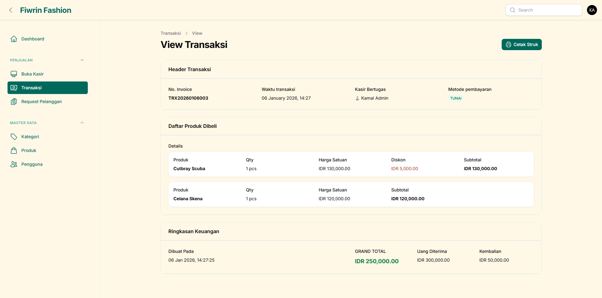
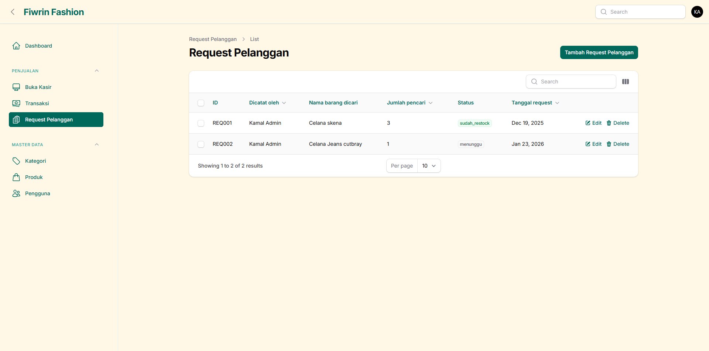
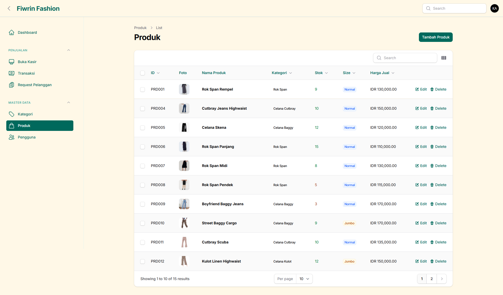
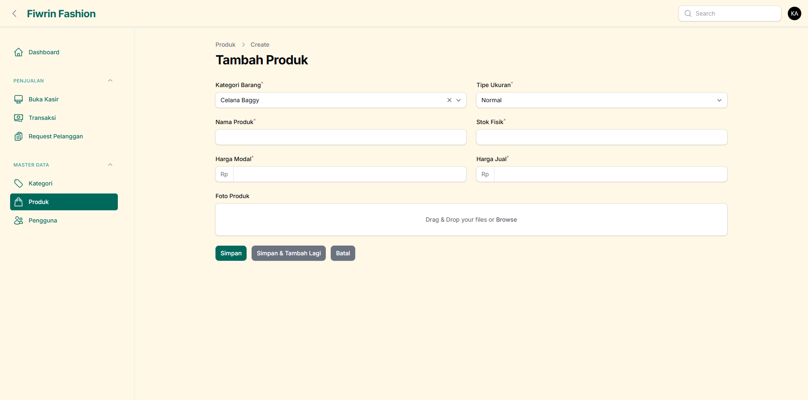
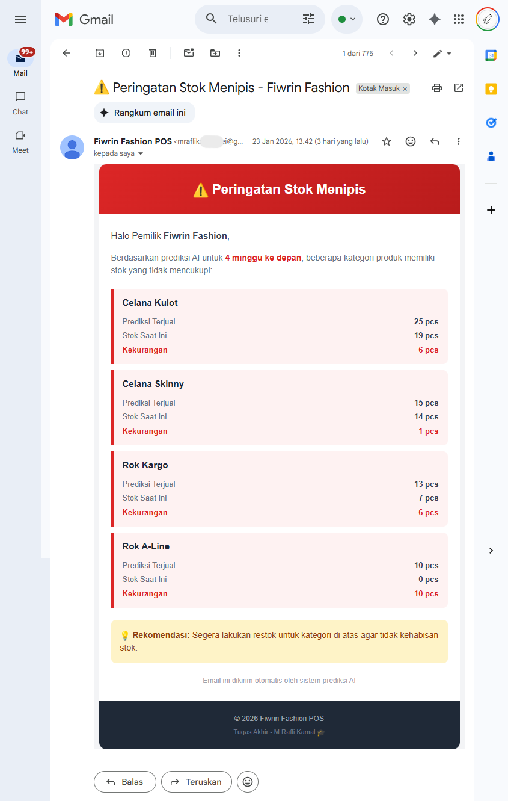

<h1 align="center">POS Fiwrin Fashion</h1>

<p align="center">
  
  
  
  
  
</p>

Aplikasi **Point of Sale (POS)** berbasis web untuk toko fashion dengan fitur prediksi penjualan menggunakan **Machine Learning (XGBoost)**. Dibangun dengan Laravel 12, Filament 4 Panel, dan Livewire 3.

---

## Fitur Utama

### 1. Modul Kasir

- Interface kasir real-time dengan Livewire
- Pencarian produk dengan filter kategori dan ukuran (Normal/Jumbo)
- Keranjang belanja dinamis dengan edit harga/diskon per item
- Multi metode pembayaran (Tunai, Transfer Bank, QRIS)
- Cetak struk thermal 58mm

### 2. Dashboard Admin (Filament)

- Statistik penjualan harian (pendapatan bersih, transaksi, produk terjual)
- Grafik pendapatan 7 hari terakhir
- Grafik prediksi penjualan 4 minggu ke depan
- Rekomendasi restok berdasarkan prediksi ML
- Top 5 produk terlaris
- Distribusi metode pembayaran

### 3. Machine Learning

- Prediksi penjualan per kategori menggunakan **XGBoost Regressor**
- Fitur temporal: bulan, minggu, hari libur (Lebaran, Idul Adha)
- Lag features untuk time series forecasting
- Evaluasi model dengan SMAPE, MAE, RMSE
- Retraining otomatis via Artisan command

### 4. Manajemen Data

- CRUD Produk, Kategori, Pengguna
- Soft delete untuk semua entitas utama
- Request pelanggan (permintaan barang)
- Export laporan ke Excel
- Custom ID generator (USR001, KAT001, PRD001, dll)

### 5. Notifikasi Email

- Notifikasi hasil prediksi ML via email
- Konfigurasi SMTP (Gmail, Mailtrap, dll)
- Template email menggunakan Laravel Mailable

---

## Tech Stack

| Layer                 | Teknologi                                  |
| --------------------- | ------------------------------------------ |
| **Backend**     | Laravel 12, PHP 8.2+                       |
| **Admin Panel** | Filament 4                                 |
| **Frontend**    | Livewire 3, Bootstrap 5                    |
| **Database**    | MariaDB 10.4 / MySQL                       |
| **ML Engine**   | Python 3.14, XGBoost, Pandas, Scikit-learn |
| **Charts**      | Chart.js                                   |
| **Email**       | SMTP (Gmail, Mailtrap, etc.)               |

---

## Persyaratan Sistem

- PHP >= 8.2
- Composer
- Node.js >= 18.x & NPM
- MariaDB 10.4+ / MySQL 8.x
- Python 3.10+ (untuk ML)
- SMTP Server (untuk notifikasi email)

---

## Instalasi & Setup

### 1. Clone Repository

```bash
git clone https://github.com/RafliKamal/pos-fiwrin-fashion.git
cd pos-fiwrin-fashion
```

### 2. Install Dependencies PHP

```bash
composer install
```

### 3. Setup Environment

```bash
cp .env.example .env
php artisan key:generate
```

Edit file `.env` dan sesuaikan konfigurasi:

```env
APP_NAME="POS Fiwrin Fashion"
APP_URL=http://localhost:8000

# Database
DB_CONNECTION=mysql
DB_HOST=127.0.0.1
DB_PORT=3306
DB_DATABASE=pos_fiwrin_fashion
DB_USERNAME=root
DB_PASSWORD=your_password

# SMTP Email (contoh Gmail)
MAIL_MAILER=smtp
MAIL_HOST=smtp.gmail.com
MAIL_PORT=587
MAIL_USERNAME=your_email@gmail.com
MAIL_PASSWORD=your_app_password
MAIL_ENCRYPTION=tls
MAIL_FROM_ADDRESS=your_email@gmail.com
MAIL_FROM_NAME="${APP_NAME}"
```

### 4. Setup Database

**Opsi A: Import SQL (Rekomendasi)**

```bash
# Import file SQL langsung ke MySQL
mysql -u root -p pos_fiwrin_fashion < db_pos_fiwrin.sql
```

**Opsi B: Migrasi Laravel**

```bash
php artisan migrate
```

### 5. Install Dependencies Frontend

```bash
npm install
npm run build
```

### 6. Setup Python Environment (Opsional - untuk ML)

```bash
# Buat virtual environment
python -m venv venv_ml

# Aktivasi (Windows)
venv_ml\Scripts\activate

# Aktivasi (Linux/Mac)
source venv_ml/bin/activate

# Install dependencies
pip install pandas xgboost scikit-learn sqlalchemy mysql-connector-python python-dotenv hijridate joblib
```

### 7. Jalankan Aplikasi

```bash
php artisan serve
```

Akses aplikasi di: `http://localhost:8000`

---

## Demo Account

Jika menggunakan import SQL, aplikasi sudah menyertakan akun demo:

| Role   | Email              | Password    |
| ------ | ------------------ | ----------- |
| Admin  | admin@fiwrin.com   | admin1234   |
| Kasir  | kasir@fiwrin.com   | kasir1234   |


---

## Penggunaan

### Akses Admin Panel

1. Buka `http://localhost:8000/admin`
2. Buat akun admin pertama saat registrasi
3. Login dan akses dashboard

### Akses Halaman Kasir

1. Login terlebih dahulu via `/admin/login`
2. Buka `http://localhost:8000/kasir`
3. Mulai transaksi dengan memilih produk

### Training Model ML

**Manual:**

```bash
# Training model
php artisan ml:train

# Jalankan prediksi
php artisan ml:predict

# Via Python langsung
cd python_scripts
python train_model.py
```

**Scheduled (Otomatis):**

Aplikasi sudah dikonfigurasi untuk menjalankan ML secara otomatis:

- `ml:train` - Setiap Senin jam 02:00 WIB
- `ml:predict` - Setiap hari jam 06:00 WIB

Untuk mengaktifkan scheduler, jalankan cron job (Linux) atau Task Scheduler (Windows):

```bash
* * * * * cd /path-to-project && php artisan schedule:run >> /dev/null 2>&1
```

---

## Struktur Direktori

```
pos-fiwrin-fashion/
├── app/
│   ├── Console/Commands/      # Artisan commands (RunPrediction)
│   ├── Filament/              # Admin panel resources & pages
│   ├── Http/Controllers/      # Web controllers
│   ├── Livewire/              # Livewire components (Kasir)
│   ├── Models/                # Eloquent models
│   ├── Policies/              # Authorization policies
│   └── Traits/                # Shared traits (HasCustomId)
├── database/
│   ├── migrations/            # Database migrations
│   └── seeders/               # Database seeders
├── python_scripts/            # ML training & prediction scripts
│   ├── train_model.py         # Model training pipeline
│   ├── predict.py             # Prediction script
│   └── Dataset_*.csv          # Training dataset
├── resources/
│   └── views/
│       ├── filament/          # Filament custom views
│       └── livewire/          # Livewire component views
├── storage/
│   └── app/ml/                # Trained ML model (.pkl)
└── routes/
    └── web.php                # Web routes
```

---

## Konfigurasi Tambahan

### Storage Link

```bash
php artisan storage:link
```

### Cache Optimization (Production)

```bash
php artisan config:cache
php artisan route:cache
php artisan view:cache
```

---

## Model Machine Learning

Model XGBoost digunakan untuk memprediksi penjualan mingguan per kategori dengan fitur:

| Fitur                   | Deskripsi                      |
| ----------------------- | ------------------------------ |
| `bulan`               | Bulan transaksi (1-12)         |
| `minggu_dalam_bulan`  | Minggu ke-n dalam bulan        |
| `kategori_encoded`    | Encoding kategori produk       |
| `rata_harga_kategori` | Rata-rata harga per kategori   |
| `is_near_lebaran`     | Proximity Idul Fitri (Hijriah) |
| `is_near_idul_adha`   | Proximity Idul Adha            |
| `lag_1, lag_2, lag_4` | Penjualan minggu sebelumnya    |
| `rolling_mean_4`      | Moving average 4 minggu        |

---

## Screenshots



















---

## License

Proyek ini dilisensikan di bawah [MIT License](LICENSE).

---

## Author

Dikembangkan sebagai proyek Tugas Akhir Muhamad Rafli Kamal.
